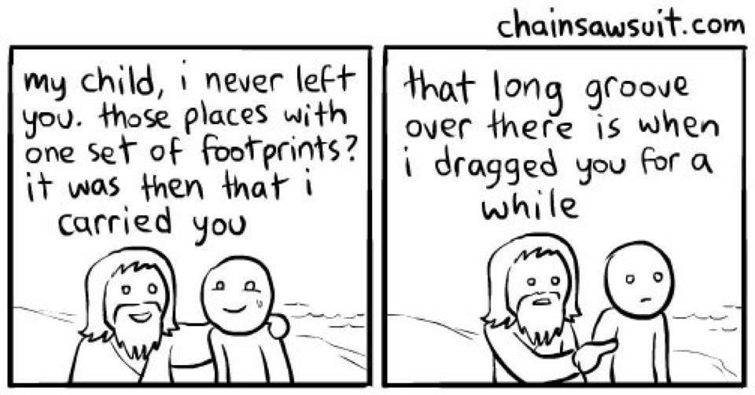

# Seminary Lesson Slides
## Weekly Presentations

  
    Choose a lesson to present <carbon:arrow-right class="inline"/>
  

  <button @click="$slidev.nav.openInEditor()" title="Open in Editor" class="text-xl slidev-icon-btn opacity-50 !border-none !hover:text-white">
    <carbon:edit />
  </button>
  <a href="https://github.com/GarthDB/seminary-slides" target="_blank" alt="GitHub"
    class="text-xl slidev-icon-btn opacity-50 !border-none !hover:text-white">
    <carbon-logo-github />
  </a>

---
layout: center
class: text-center
---

# Available Lessons

  <h3 class="text-xl font-bold mb-2">September 19, 2025</h3>
  
Today's lesson with QT Time

  

    Navigate to next slide to start lesson
  

  <h3 class="text-xl font-bold mb-2">Future Lessons</h3>
  
Coming soon...

  

    Use templates to create new lessons
  

---
layout: default
---

# Welcome to Seminary

## Today's Focus
- **Scripture Study**: [Add your scripture reference]
- **Key Principle**: [Add the main principle]
- **Application**: [How students can apply this]

## Class Structure
1. **Opening Prayer** (2 min)
2. **QT Time** (10 min) - Christopher
3. **Scripture Study** (15 min)
4. **Discussion** (20 min)
5. **Application** (10 min)
6. **Closing Prayer** (3 min)

---
layout: section
---

### QT Time

<!-- PRESENTER NOTES:
- Christopher prepared this question from his virtual lesson reflections
- This question touches on themes of service, ministering, and recognizing God's hand in others' lives
- The "Primary Answers" insight from Carly is about seeing first/highest priority responses to faith questions
- The Spirit & Revelation insight emphasizes the importance of actively seeking the Spirit
- Elder Bednar's series helps students understand how to recognize and receive spiritual light
- Use the memes to lighten the mood and connect with students
- Encourage discussion about how they can help each other recognize blessings
-->

### This Week's Leader: Christopher

#### Main Question
**"Can we help each other in dissecting or feasting on the blessings that others have in store for them?"**

### Light Bulb Moments

• **Faith Building**: "How can I increase my faith in Jesus Christ?"  
  *Answer: "Primary Answers" - First or Highest in Rank*

• **Spirit & Revelation**: "If you don't ask for and allow the spirit in your life, you will never be able to have it until you do."

• **Trust & Faith**: "How can I trust in him better when I don't see the full picture and don't see all the different sides?"

• **Elder Bednar's Light Series**: Three-part video series on knowing and receiving Light in our Lives

---
layout: section
---

# Scripture Study

<!-- PRESENTER NOTES:
- This revelation was given in December 1833 after the Saints were driven from Jackson County, Missouri
- Joseph Smith was in Kirtland, Ohio, but was deeply concerned about the Saints' suffering
- The Saints had been warned multiple times about their transgressions but didn't fully repent
- Key context: The Saints had been critical of Joseph Smith, engaged in contention, and ignored warnings
- The Lord's compassion is remarkable - despite their sins, He still loves them and wants to help them
- This lesson helps students understand that God's love is not conditional on our perfection
- The "bowels of compassion" phrase shows the depth of the Savior's love and mercy
-->

  <h2 class="text-4xl font-bold mb-8">Doctrine and Covenants 101:1-42</h2>
  

    <a href="https://www.churchofjesuschrist.org/study/scriptures/dc-testament/dc/101?lang=eng&id=p1-42#p1" target="_blank" class="text-blue-600 hover:text-blue-800 underline">
      Read the full chapter →
    </a>
  

  
"Notwithstanding Their Sins, My Bowels Are Filled with Compassion"

## Key Verses
- **[D&C 101:1-2](https://www.churchofjesuschrist.org/study/scriptures/dc-testament/dc/101?lang=eng&id=p1-2#p1), 6-8** - Why the Lord allowed the Saints to suffer
- **[D&C 101:9](https://www.churchofjesuschrist.org/study/scriptures/dc-testament/dc/101?lang=eng&id=p9#p9), 12-16** - The Savior's compassion despite their sins
- **[D&C 101:16-19](https://www.churchofjesuschrist.org/study/scriptures/dc-testament/dc/101?lang=eng&id=p16-19#p16)** - The Lord's perspective on Zion and gathering
- **[D&C 101:27-38](https://www.churchofjesuschrist.org/study/scriptures/dc-testament/dc/101?lang=eng&id=p27-38#p27)** - The coming Millennium and eternal perspective

---
layout: two-cols
---

# Key Principles

<!-- PRESENTER NOTES:
- Use the v-click animations to reveal each point and discuss them individually
- The Savior's Compassion: Emphasize that this is unconditional love - He loves us even when we sin
- Share personal examples of feeling the Savior's compassion despite mistakes
- Divine Chastening: Help students understand that correction = love, not punishment
- Ask students: "When have you felt God's love through correction or redirection?"
- Connect to their lives: "How does knowing God loves you unconditionally change how you approach repentance?"
- The "bowels of compassion" phrase is very personal and emotional - the Savior feels deeply for us
-->

::left::

## The Savior's Compassion
**"Notwithstanding their sins, my bowels are filled with compassion"** ([D&C 101:9](https://www.churchofjesuschrist.org/study/scriptures/dc-testament/dc/101?lang=eng&id=p9#p9))

- <v-click>Christ sees all facets of our situation clearly</v-click>
- <v-click>He doesn't rashly condemn us despite our weaknesses</v-click>
- <v-click>He continues to work with us compassionately over time</v-click>
- <v-click>His love is not conditional on our perfection</v-click>

::right::

## Divine Chastening
**"As many as I love, I rebuke and chasten"** ([D&C 101:5](https://www.churchofjesuschrist.org/study/scriptures/dc-testament/dc/101?lang=eng&id=p5#p5))

- <v-click><strong>Purpose 1</strong>: To persuade us to repent</v-click>
- <v-click><strong>Purpose 2</strong>: To refine and sanctify us</v-click>
- <v-click><strong>Purpose 3</strong>: To redirect our course to a better path</v-click>
- <v-click>Chastening is evidence of God's love, not rejection</v-click>

---
layout: center
class: text-center
---

# Discussion Questions

<!-- PRESENTER NOTES:
- Give students time to think before asking for responses
- These questions are designed to help students apply the principles personally
- Question 1: Look for students to share specific experiences of feeling God's love despite mistakes
- Question 2: This is from Elder Soares' quote - help them understand the Savior's patience
- Question 3: Connect compassion to motivation for repentance - love drives change, not fear
- Question 4: This connects to the Grace scenario from the Canvas assignment - practical application
- Encourage students to share specific examples and stories
- If discussion is slow, ask follow-up questions like "What does 'bowels of compassion' mean to you?"
-->

1. **How have you experienced the Savior's compassion in your life, even when you've made mistakes?**

2. **What does it mean to you that Christ "does not rashly condemn us but continues to work with us compassionately over time"?**

3. **How can understanding the Savior's compassion and mercy impact your motivation to repent?**

4. **How would you help someone like Grace feel confident in the Savior's love for them?**

---
layout: section
---

# Application

<!-- PRESENTER NOTES:
- This is the practical application section - help students take action
- The Grace scenario is from the Canvas assignment - a young woman who feels distant from the Church
- Challenge them to actually write a text (even if they don't send it) - this makes it real
- Personal Reflection: This is Elder Soares' quote from the lesson materials
- Give students a few minutes to think about this question
- Ask for volunteers to share how this changes their perspective
- Connect to the main principle: God's love is unconditional, even when we sin
- This is a good time to bear testimony of the Savior's love and compassion
-->

## This Week's Challenge
**Write a text to someone like Grace** - someone who feels distant from the Savior. Include specific words and phrases from D&C 101 that could help them feel the Savior's compassion and mercy.

## Personal Reflection
**Consider Elder Soares' teaching**: "Even knowing all our weaknesses as He does, the Savior does not rashly condemn us but continues to work with us compassionately over time."

How does this change your view of the Savior's love for you?

---
layout: center
class: text-center
---

# Closing

## Key Takeaways
- **The Savior's compassion is not conditional** - He loves us despite our sins and weaknesses
- **Divine chastening is evidence of love** - God corrects us to help us become better
- **We can help others feel the Savior's love** by sharing these truths with compassion

## Next Week
Continue studying the Doctrine and Covenants and the Restoration of the gospel

  "And now, my sons, remember, remember that it is upon the rock of our Redeemer, who is Christ, the Son of God, that ye must build your foundation..."
  
- <a href="https://www.churchofjesuschrist.org/study/scriptures/bofm/hel/5?lang=eng&id=p12#p12" target="_blank" class="text-blue-600 hover:text-blue-800 underline">Helaman 5:12</a>

---
layout: end
---

# Thank You

## Questions?

Feel free to ask any questions about today's lesson.

## Next Class
[Add next class details]

  Seminary Lesson - September 19, 2025

